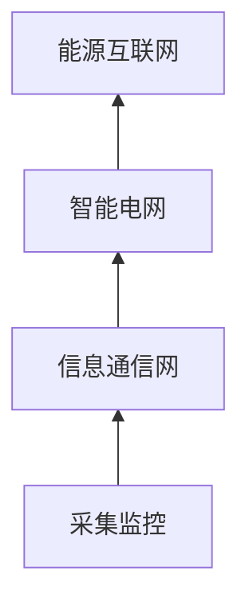

## 2017/11/25
### 开幕致辞
见录音

---
### 智慧能源与数据同行
国家电网公司×王继业
- 信息化中国特色化
	- 数字化
	- 信息化
	- 智慧化
- 密切结合互联网，能源互联网
- **形势与挑战**
- **能源互联网**
	- 与信息互联网的相似性
	- 不同点（主要为物理性质）
		- 能源的传输存在损耗
		- 传输方向单工

- **最终推动电网运营向综合能源服务转变**
---
### 携手共建新时代中国特色
华能集团×朱卫列
- Sensor Fusion?
- 业务与IT的结合，从测量值到特征值
- 工业领域较少人工智能的分析
- 体制优势：
	- 数据大国
	- 工业大国 
---
### 新IT助力电力新经济
新华三×肖春华

--- 
### 贵州电网数据研究与实践
贵州电网×罗念华
- 发展概况
	- 背景
	- 初步成果
		- 创新企业超过8000家
- 实践
	- 历史规划
	- 数据应用

- 未来
	- 电动汽车自动充电
---
### 智能电网-数据先行
华为×伏兴平
- 消费变革
- 挑战
	- 传统数据仓库-->融合的大数据平台

---
### 联万物，启智能
思科×海广沃
- 云端边缘化
	- 雾计算？
---
### 智能电网云数据中心网络建设
中兴×李耀文
- 云数据中心的关键需求
	- 安全可靠
	- 通过大数据分析发现安全威胁
- 智能运维
	- 弹性伸缩，基于智能，预留空间，稳定性高的尽量少频次
---
### AI对计算能力
浪潮×朱炯
- 挑战
- 深度学习
- 框架caffee, 深度定制服务器
---
### 大数据技术的高效应用
南大通用×武新
- 需求及价值
	- 成本中心-->盈利中心
- 电力行业信息化
---
### 信息技术新领域标准化现状和发展趋势
中国电子技术标准化研究院×杨建军

---
### 下午场

---
### 智慧企业设备管理大数据应用 -- 浅谈大数据应用
- 例子（主要是火电的例子，时序数据库）
	- 热力系统分析
	- 锅炉
	- 水泵 
- 状态检测--异动
	- 指标变化对比模型特征值，历史变化值
- 大数据可能通过服务的方式去盈利而非产品的模式

- KDM
	- 数据层的整理成特征值的方法？

### 数据中心场地基础设施生命周期全过程第三方验证与认证服务
北明软件
- 验证
	- 适应不同的软硬件周期
	- 保证建设方与运行方有效的交互
- 评价
- 风险评估

---
### 基于Spark的大数据匿名化系统
北邮博士后，大数据脱敏
- 背景
	- K组泛化？，单向哈希，加密（这里讲了个缺点我没听懂）
	- 数据作为整体输入，多样性
- 实现
	- Hadoop Spark
	- Mondrian算法，脱敏的算法没怎么听懂
	- O(NlogN)
	- 数值类型分类
		- 快速排序or桶排序，这里我没听明白，我觉得这个是一个Maximum Gap的问题
- 结论
	- 能够在数据公开，共享时对数据进行有效匿名
	- 大数据平台实现该算法相比单机平台提升效率

---
### 数字化资产管理
SAP
- 全生命周期管理

- 基于机理的模式+基于机器学习/人工智能预测性维护
- 用无监督学习做异常检修
- 电力案例较少
- 意大利铁路--列车动态维修项目
	- PCA做状态检修
	- EMD算法，分析车用电池的异常状态
- 可扩充的框架，据说可以接入Tensorflow API
- 结论：在设备资产大数据分析领域，与电力企业有诸多合作点

---
### 基于海量实时监控数据的服务影响分析与可视化
国网，高级工程师

- 背景：
	- 众多系统，缺少映射关系
- 功能设定

- 形成标准故障库

<!--stackedit_data:
eyJoaXN0b3J5IjpbLTEyNDMwNzc2OTddfQ==
-->