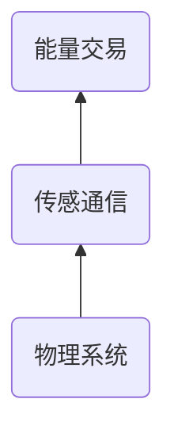

## 2017/11/26
### 优秀论文获奖
见录音
### 能源领域大数据分析
清华大学×曹军威
- 从互联网到能源互联网
- 能源互联网层次功能
	- 物理系统-传感通信-能量控制-能量交易

- 能源互联网量测单元
	- 可扩展，低成本
- 大数据分析

--- 
### 管理是移动安全运营的核心
梆梆安全×贝松涛 
- 挑战
	- 持续迭代的安全运营
		- 安全运营角色繁多，如何协作，高效
	- 打造ISO标准体系下的“移动透明厨房”
		- 标准可视-->流程可视-->执行动作可视-->全员参与
	- 工作如何“可量化”
		- 做得好不出事，存在感差
		- 做得好出了事，白费 
		- 做的不好不出事
		- 做的不好出了事
- 安全体系最佳实践

---
### 网络与信息安全态势分析及挑战
国家能源局信息中心处长，陈雪宏
- 攻击的特点
	- 多为利益集团或者其他国家发起
- 等级保护制度
- 挑战
	- 复合型人才缺失
	- 边界完整性威胁
	- 定级备案整改未闭环
	
---
### 面向行业应用的云网一体服务
烽火通信
- 数字化转型
- 机遇与挑战
	- 机遇
		- 一带一路
		- 云计算的广泛应用
		- 。。。
	- 挑战
		- 电力安全
		- 新旧能源整合
		- 。。。
	- 电力系统数字化的核心
	
	- 云网一体化的核心
		- 第一条是**开放自主**的云平台
		- 烽火基于Openstack深度定制FitOS
	- 各家的大数据平台架构基本差不多，最大的不同点在于不同行业的建模
	
---
### 量子信息技术及其在电力信息中的应用展望
中国科学技术大学教授，韩正甫
- 信息的量子化处理
	- Binary bit --> 量子态
		- 量子态（偏正，频率）
	- Qbit(量子态)
		- 偏振，自旋，能级
		- <$\psi_1,\psi_0$> ？？
		- 波函数
			- 本身不可以被测量，平方才代表粒子被发现的概率
- 经典信息与量子信息比较
	- 实数域 vs 复数域
	- 任何一个$n$位存储器，某时刻可存储$2^n$个数据（理想）
	- 实际上效果要打折扣
	- 科学家试图发现极限区间
- 量子计算机，这个再说
- 密匙分配，BB48，现在唯一的应用 
- 电力纵向加密
- 基于量子密码的独立内网安全加密互联
	- 所有内网数据加密输出
	- 外网数据可以进来
	- 兄弟内网数据解密进入内网

---
### 总结
见录音

<!--stackedit_data:
eyJoaXN0b3J5IjpbLTUxNDYzNjcyMl19
-->